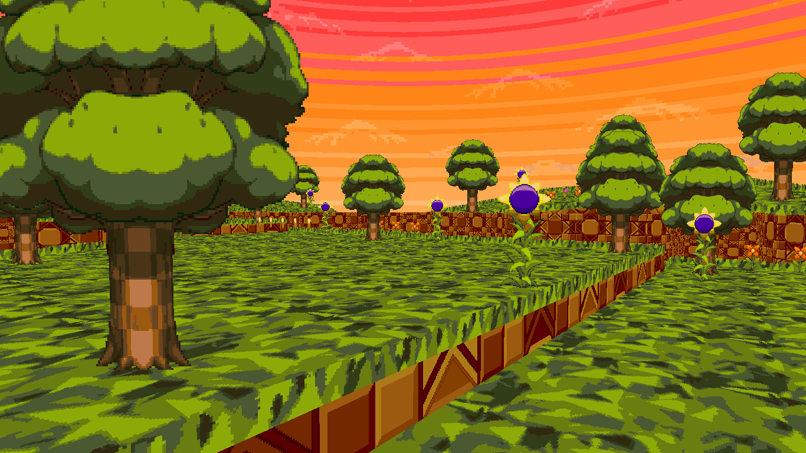
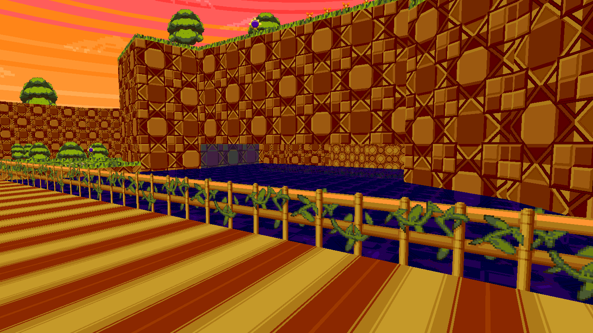
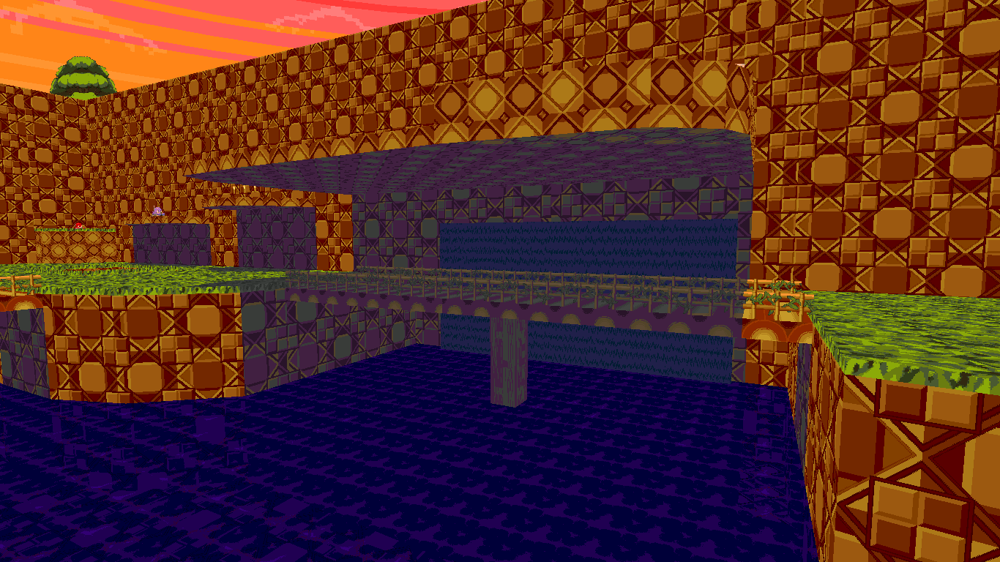

# Sonic Robo Blast 2001: Re-Quested
Sonic Robo Blast 2001: Re-Quested (or SRB2001-RQ for short) is a big **WIP** map pack for [Sonic Robo Blast 2 (SRB2)](srb2.org) based on old material from it's history (such as the "Beta Quest" line of levels, dev levels that never made the final cut and things we have seen from the future of the game) while adding my ideas and concepts to make it feel fresh! (i think)

This may seem like something already made (which is kinda true) but this has something different, something, unique... (I think)

## Story
There's no established lore or story at the time i'm writing this but there **WILL** be a story in the future.

## Content
First of all, since this is a map pack, I'll list all main campaign zones below:
- Sunset Flowers Zone
- Forgotten Hardware Zone
- Drenched Caverns Zone
- Tubular Tunnels Zone
- Cloudy Cliff-Face Zone
- Blazing Vermilion Zone
- Forsaken Square Zone
- 'Osphere Doomship Zone
- Frantic Geode Zone

I don't really have any screenshots of the maps since it's still a very W.I.P map pack so expect some in the future.

  
  
  

 

I will NOT list some of the exclusive stuff or unlockable/secret levels from this map pack because It would ruin the surprises, but you can always download the mod and discover It for yourself! (If I ever finish this obviously)

## Credits and Assets (SPOILERS FOR THE MAP PACK)
Things that I used for this project:
- [NeonSRB2 for "More and Better Super Forms"](https://mb.srb2.org/addons/more-and-better-super-forms.1330/)
- [TheLastKitchenGun for "Super Sparkles"](https://mb.srb2.org/addons/super-sparkles.4111/)
- [ClovesCloestarSRB2 for "New Springs!"](https://mb.srb2.org/addons/new-springs.8942/) (used for different powers of springs)
- [TehRealSalt for "Jump Leniency"](https://mb.srb2.org/addons/jump-leniency.2821/)
- [Sir Thoksalot for "Hyper Sonic"](https://mb.srb2.org/addons/hyper-sonics-directional-dash.2774/) (modified)
- [Team Prismatic For "Mystic Realm: Community Edition"](https://mb.srb2.org/addons/the-mystic-realm-community-edition-mrce.8345/) (used for hyper sonic flashing skincolor and music change code)

The rest of the lua is created by me (hangout stuff, not drowning if super / hyper, the new palletes and part of the hyper sonic stuff like the dark emerald, custom emblems and the super fight stuff)

## Behind The Project!
This section tells all the stuff that happed before even this project existed!

It started a long time ago, I wanted to do something srb2-related because I was bored and decided to port the "Beta Quest" to 2.2 (100% original idea, absolutely) because I really loved those dev maps in general, I also added some extra content like the Dark City Zone 2.0 dev and Sonic's Nightmare Zone. It was very, very, VERY poorly made because I was just using the SRB2:TP maps but without the old textures (only using vanilla textures) so it was very boring, and when i "finished" it, I didn't know what to do next, and I stayed like that for a long time...

Until one day, something came to my head that would make this project to another level...

What if, instead of starting the game at daytime, it started at a sunset! (i know, absolutely amazing)

And that's mainly the reason I'm doing this whole map pack in the 1st place, to experiment with the ideas of those dev maps and give them their own time-changing twist! (and also using UZB) I had to learn a LOT of stuff to get to this point and I'm really excited to see how this develops in the future! This might be my only project for a while so I hope it goes well.

There's also other things I added but I can't tell them here because They're TOP SECRET and are very funny surprises to find!

## Getting the map pack itself!
To get the latest version of this map pack, you have 3 options

### Option A
Download the Source and execute the "build_RQ.bat" file inside it, this will build you a .pk3 file with the map pack itself! Btw, this is a modified version of the "[build_MRCE.bat](https://gitlab.com/team-prismatic/mystic-realm-ce/-/blob/next/build_MRCE.bat?ref_type=heads)" from the [MRCE GitLab](https://gitlab.com/team-prismatic/mystic-realm-ce/), so credits to them!

### Option B
You can also download the Source and (inside the src folder) zip up the all the files into a .zip and renaming the file to .pk3!

### Option C
Wait for a build in the "[Releases](https://github.com/Leonidas4487/SRB2001-RQ/releases)" section and downloading it!
Right now the build in the "[Releases](https://github.com/Leonidas4487/SRB2001-RQ/releases)" section is the same as the source but in the future this may not be the same because the "releases" are only going to happen when I add various small and big changes/additions to the map pack.

Btw if you find some error or maybe you have a suggestion, leave it here so I can see it!

If you readed this to the end, thanks for watching this page! 💙

##### You could say... Thanks for watching my dream!
